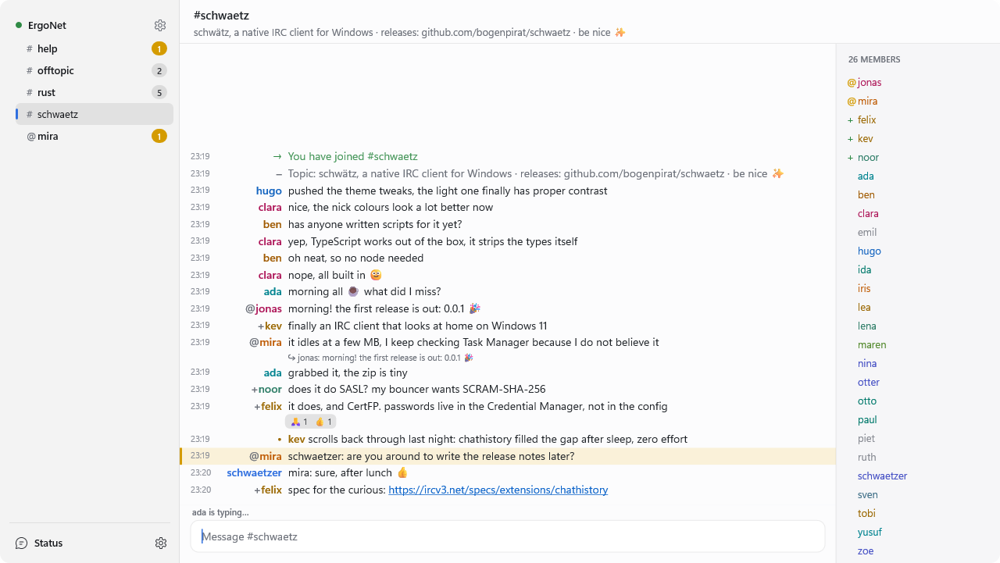

<div align="center">


<h1>schwätz</h1>

<p><strong>A fast, native IRC client for Windows.</strong><br>
Modern IRCv3, bouncers and Twitch, in one small executable.</p>

[](https://github.com/bogenpirat/schwaetz/actions/workflows/ci.yml)
[](https://github.com/bogenpirat/schwaetz/releases/latest)
[](https://github.com/bogenpirat/schwaetz/releases)

[](https://www.rust-lang.org)
[](LICENSE)

[**Download**](https://github.com/bogenpirat/schwaetz/releases/latest) ·
[Features](#features) ·
[Building](#building) ·
[Configuration](docs/configuration.md) ·
[Scripting](docs/scripting.md)

<br>

<picture>
  <source media="(prefers-color-scheme: dark)" srcset="docs/images/screenshot-dark.png">
  
</picture>

</div>

## Features

- **Native and light.** Win32 and Direct2D, one ~4 MB download, no installer or runtime, no CPU
  use while idle. Dark and light themes that follow Windows, Mica on Windows 11.
- **Modern IRC.** IRCv3 with SASL, chat history, replies, reactions, typing indicators, read
  markers and more.
- **Bouncers.** ZNC and soju, including playback of missed messages.
- **Twitch.** Badges, name colours, emotes with completion, live status, sign in with Twitch.
- **Scriptable.** JavaScript or TypeScript, built in; see [scripting](docs/scripting.md).
- **Comfortable.** Quick switcher (**Ctrl+J**), searchable history, highlights, notifications,
  tray icon, logs.

## Getting started

[Download the latest release](https://github.com/bogenpirat/schwaetz/releases/latest), extract it
and run `schwaetz.exe`. It starts with Libera.Chat configured: right-click it in the sidebar and
choose **Connect**. The **⚙** button at the bottom of the sidebar adds networks and opens the
settings, and `/help` lists all commands.

## Building

You need [Rust](https://rustup.rs) (stable, MSVC toolchain) and the
[Visual Studio Build Tools](https://visualstudio.microsoft.com/visual-cpp-build-tools/) with the
C++ workload.

```powershell
git clone https://github.com/bogenpirat/schwaetz
cd schwaetz
cargo build --release
.\target\release\schwaetz.exe
```

Tests, the Twitch app setup and the project layout are described in
[docs/development.md](docs/development.md).
